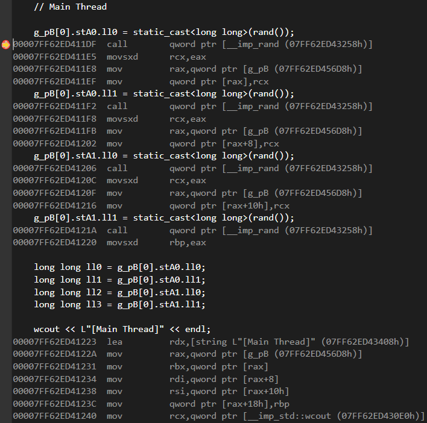
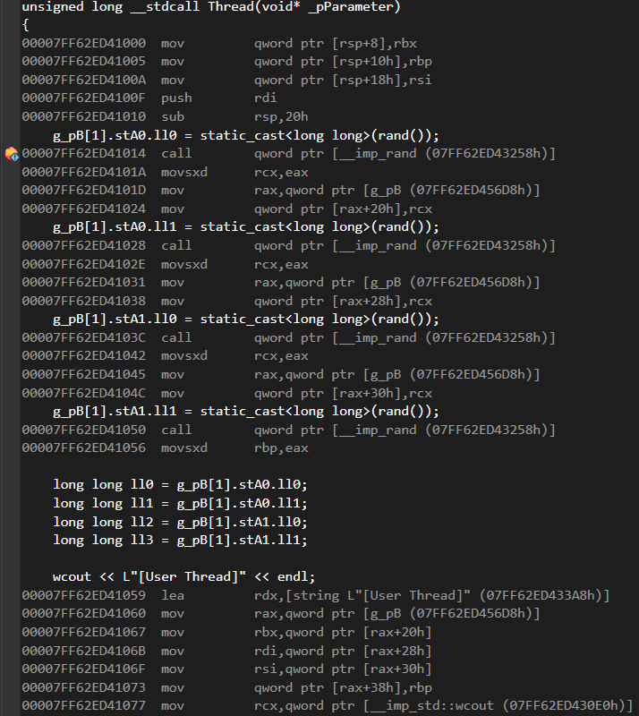

# Test-MemberVariableAccessInAssembly

## Environment

- Window 10 sdk 10.0.22000  
- Visual Studio 2019  
- ISO c++17  

## Result

- Write

```
mov rax, [Variable]  
mov [rax + n(offset)], rcx (WriteValue)
```

- Read

```
mov rax, [Variable]  
mov register, [rax + n(offset)]
```



